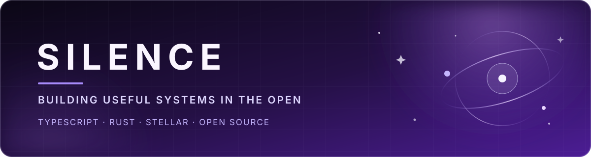

  

  
  
  

## Hey, I'm Silence 👋

I build developer tools, financial infrastructure, and community software—with a particular fondness for the Stellar ecosystem. My work moves between TypeScript applications, Rust SDKs and smart contracts, and the infrastructure that helps people ship reliably.

- 🪐 Working across the **Stellar**, **Hoops Finance**, and **Circle** ecosystems
- 🛠️ Most at home in **TypeScript** and **Rust**, with Python for the jobs it handles best
- 🧭 Interested in developer experience, Soroban, open-source infrastructure, and AI-assisted engineering
- 💬 Find me on X as [**@silencexlm**](https://x.com/silencexlm)

## Selected work

<table>
  <tr>
    <td width="50%" valign="top">
      <a href="https://github.com/stellar/laboratory"><strong>Stellar Laboratory</strong></a> 
      Tools for exploring, testing, and learning the Stellar network. 
      TypeScript · Next.js · Stellar
    </td>
    <td width="50%" valign="top">
      <a href="https://github.com/stellar/rs-soroban-sdk"><strong>Rust Soroban SDK</strong></a> 
      The Rust SDK for building Soroban smart contracts. 
      Rust · Soroban · Smart contracts
    </td>
  </tr>
  <tr>
    <td width="50%" valign="top">
      <a href="https://github.com/silence48/m3u2strm"><strong>m3u2strm</strong></a> 
      Converts M3U playlists into an Emby-friendly STRM folder structure. 
      Python · Media tooling
    </td>
    <td width="50%" valign="top">
      <a href="https://github.com/silence48/new-soroban-fiddle"><strong>Soroban Fiddle</strong></a> 
      Parses contract specs so invocations can be simulated and explored. 
      TypeScript · Soroban · Developer tooling
    </td>
  </tr>
</table>

## Toolbox

  
  
  
  
  
  
  
  

## GitHub at a glance

<table>
  <tr>
    <td width="58%" valign="top">
      <picture>
        <source media="(prefers-color-scheme: dark)" srcset="https://github-stats-extended.vercel.app/api?username=silence48&show_icons=true&include_all_commits=true&show=reviews,discussions_started,discussions_answered,prs_merged,prs_merged_percentage&rank_icon=github&hide_border=true&theme=shades-of-purple" />
        <source media="(prefers-color-scheme: light)" srcset="https://github-stats-extended.vercel.app/api?username=silence48&show_icons=true&include_all_commits=true&show=reviews,discussions_started,discussions_answered,prs_merged,prs_merged_percentage&rank_icon=github&hide_border=true&theme=buefy" />
        
      </picture>
    </td>
    <td width="42%" valign="top">
      <picture>
        <source media="(prefers-color-scheme: dark)" srcset="https://github-stats-extended.vercel.app/api/top-langs/?username=silence48&langs_count=8&layout=compact&hide_border=true&theme=shades-of-purple" />
        <source media="(prefers-color-scheme: light)" srcset="https://github-stats-extended.vercel.app/api/top-langs/?username=silence48&langs_count=8&layout=compact&hide_border=true&theme=buefy" />
        
      </picture>
    </td>
  </tr>
</table>

  Language cards reflect public repositories, so private work is intentionally not part of that picture.

---

  <a href="https://octo-ring.com/p/silence48/prev">← previous</a>
  &nbsp;·&nbsp;
  <a href="https://octo-ring.com/">Octo Ring</a>
  &nbsp;·&nbsp;
  <a href="https://octo-ring.com/p/silence48/random">random</a>
  &nbsp;·&nbsp;
  <a href="https://octo-ring.com/p/silence48/next">next →</a>

